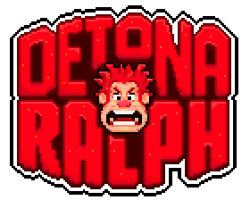
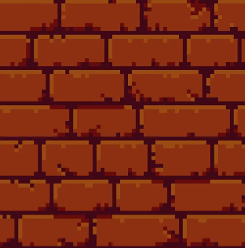
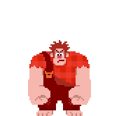

# 🎮 Detone o Ralph

## 📝 Sobre o jogo
Detone o Ralph é um jogo de reflexos inspirado no clássico da Disney.  
Seu objetivo é simples: **acertar o Ralph antes que ele fuja!**  
Mas cuidado... errar o alvo faz você perder vidas.  
O jogo termina quando o tempo acaba ou suas vidas chegam a zero.

---

## 🚀 Tecnologias usadas
- **HTML5**
- **CSS3** (Reset + estilização personalizada)
- **JavaScript** (DOM + lógica de jogo)
- **GitHub Pages** para hospedagem

---

## 🎯 Como jogar
1. Clique em **"▶ Iniciar Jogo"**.
2. Use o **martelo** (cursor) para clicar no Ralph quando ele aparecer.
3. Ganhe pontos a cada acerto.
4. Evite errar! Cada erro tira uma vida.
5. O jogo acaba quando o tempo ou suas vidas chegarem a zero.

---

## 📷 Imagens do jogo

